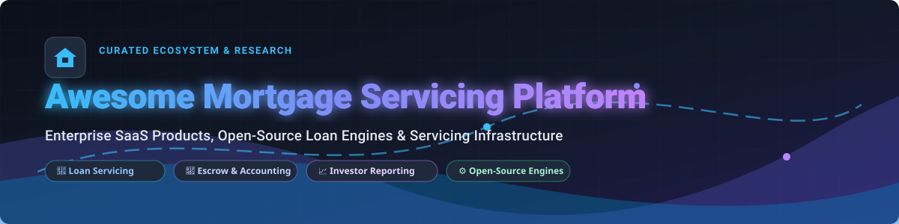

# 🏦 Awesome Mortgage Servicing Platform

<a href="https://github.com/ishandutta2007/Awesome-Awesome-Awesome"></a>
<a href="https://discord.gg/jc4xtF58Ve"></a>
[](https://github.com/ishandutta2007/Awesome-Awesome-Awesome)
[](https://github.com/ishandutta2007/Awesome-Mortgage-Servicing-Platform/pulls)
[](LICENSE)
[](#)
<a href="https://github.com/ishandutta2007"></a>

> 🚀 **A curated directory of enterprise SaaS loan servicing software, open-source lending engines, amortization libraries, escrow analytics, and GSE investor reporting tools.**

---

## 📌 Table of Contents

- [📑 Overview & Scope](#-overview--scope)
- [🏢 Enterprise SaaS Platforms](#-enterprise-saas-platforms)
- [💻 Open-Source GitHub Projects](#-open-source-github-projects)
- [⚙️ Core Functional Modules](#%EF%B8%8F-core-functional-modules-in-mortgage-servicing)
- [⚖️ Regulatory Compliance & GSE Alignment](#%EF%B8%8F-regulatory-compliance--gse-alignment)
- [💡 How to Contribute](#-how-to-contribute)
- [💖 Support & Sponsorship](#-support--sponsorship)
- [⚠️ Legal & Compliance Disclaimer](#%EF%B8%8F-legal--compliance-disclaimer)
- [📈 Star History](#-star-history)

---

## 📑 Overview & Scope

Mortgage servicing software handles the complex **post-origination loan lifecycle**: payment processing, escrow administration (taxes & insurance), loss mitigation/default management, borrower self-service portals, and mandatory secondary-market investor reporting (Fannie Mae, Freddie Mac, Ginnie Mae).

---

## 🏢 Enterprise SaaS Platforms

> 📊 **Market Size & Sector Structure:** The global **Mortgage & Loan Servicing Software Market** is estimated at **$5.57 Billion to $7.20 Billion** (2025–2026) and is projected to reach **$8.20+ Billion by 2030** (CAGR ~8%). The enterprise residential mortgage sector is **highly concentrated and oligopolistic**—with dominant legacy platforms (such as ICE MSP and Sagent) processing over **60%–70% of all US mortgage loans** due to massive regulatory compliance barriers (CFPB, Fannie Mae, Freddie Mac, Ginnie Mae investor reporting). Mid-market private/specialty lending servicing remains **moderately fragmented**.

*The table below compares leading commercial SaaS platforms and subservicing providers, sorted by company valuation / scale (descending):*

| Product & Provider 🏢 | Company Scale & Valuation 📈 | Starting Price Tier 💵 | Free Tier / Trial Limits ⏳ | Key Servicing Focus & Strengths ⚙️ |
| :--- | :--- | :--- | :--- | :--- |
| **[ICE MSP](https://www.ice.com/)** | **NYSE: ICE** (~$95B+ Market Cap, $8.8B+ Rev) | **$15,000/mo base** + $1.50–$3.00 per active loan/mo | **No free tier/trial** *(Requires enterprise sales demo & sandbox onboarding)* | Flagship enterprise MSP core platform; dominant in GSE residential servicing, investor reporting, and escrow automation. |
| **[LoanCare](https://www.loancare.com/)** | **NYSE: FNF** (~$16B+ Market Cap, $11B+ Rev) | **$6.00 per loan/mo** (Min portfolio fee ~$5,000/mo) | **No free tier/trial** *(Contractual subservicing onboarding & audit required)* | Full-service subservicing provider with proprietary digital borrower portal, escrow administration, and loss mitigation. |
| **[ServiceMac](https://www.servicemac.com/)** | **NYSE: FAF** (~$7B+ Market Cap, $6B+ Rev) | **$5.00 per loan/mo** (Min portfolio commitment ~$4,000/mo) | **No free tier/trial** *(Custom subservicing RFP & audit onboarding process)* | Tech-first subservicing platform delivering real-time analytics, default management, and investor cash accounting. |
| **[Finastra Mortgagebot](https://www.finastra.com/)** | **Vista Equity** (~$1.9B+ Annual Revenue) | **$5,000/mo base** enterprise platform license | **No free tier/trial** *(Guided enterprise sandbox environment upon request)* | Integrated mortgage technology ecosystem covering origination, subservicing links, and community bank loan management. |
| **[Cloudvirga](https://www.cloudvirga.com/)** | **NYSE: STC** (~$1.8B+ Market Cap, $1.1B+ Rev) | **$1,500/mo base** + $15–$25 per closed loan file | **No free tier/trial** *(Interactive enterprise workflow demo required)* | Cloud-native loan platform linking digital closing workflows to post-closing and automated borrower onboarding. |
| **[MeridianLink Servicing](https://www.meridianlink.com/)** | **NYSE: MLNK** (~$1.5B+ Market Cap, $310M+ Rev) | **$2,500/mo base** enterprise license tier | **14-Day Sandboxed Demo** *(Available for accredited financial institution teams)* | Multi-asset lending suite integrating consumer mortgage servicing with credit union and community bank core systems. |
| **[Sagent](https://www.sagentlending.com/)** | **Warburg Pincus** (~$1.0B+ Valuation, $200M+ Rev) | **$5,000/mo base** + volume tiered pricing | **No free tier/trial** *(Enterprise demonstration and technical review required)* | Modern cloud-native mortgage servicing suite (DARA) powering real-time loss mitigation, borrower portal, and GSE reporting. |
| **[LoanPro Mortgage](https://loanpro.io/)** | **FTV Capital** (~$500M+ Valuation, $100M+ Raised) | **$1,200/mo base** *(Includes up to 1,000 active accounts)* | **14-Day Free Trial** *(Full sandbox API keys and developer environment)* | Highly API-first loan servicing engine built for fintechs, private mortgage lenders, and flexible repayment waterfalls. |
| **[Dovenmuehle Servicing](https://www.dovenmuehle.com/)** | **Private / Enterprise** (~$150M+ Rev, 500+ employees) | **$5.50–$8.50 per loan/mo** subservicing tier | **No free tier/trial** *(Formal subservicing proposal and compliance review)* | Top-tier private mortgage subservicer executing full agency investor reporting, escrow audits, and customer support. |
| **[Covius](https://www.covius.com/)** | **Private Equity** (~$150M+ Revenue) | **$2,000/mo base** per module bundle | **No free tier/trial** *(Enterprise SaaS demonstration upon request)* | Specialized technology services covering default management, document generation, title lookup, and compliance tools. |
| **[Dark Matter](https://www.darkmatter.xyz/)** | **Constellation Software** (~$100M+ Revenue) | **$4,000/mo base** enterprise platform fee | **No free tier/trial** *(Enterprise sales review and guided sandbox)* | Modernized loan servicing technology (formerly Black Knight Empower/AIVA AI) offering automated workflow robotics. |
| **[Shaw Systems](https://www.shawsystems.com/)** | **Private Enterprise** (~$50M+ Revenue) | **$3,500/mo base** financial platform tier | **No free tier/trial** *(Guided technical demonstration environment)* | Established loan accounting and servicing software for commercial, consumer, and specialty mortgage lenders. |
| **[Calyx](https://www.calyxsoftware.com/)** | **Privately Held** (~$40M+ Revenue) | **$89/user/mo** *(or $350/mo base for servicing modules)* | **30-Day Free Trial** *(Full product suite trial for qualifying mortgage teams)* | Accessible loan software suite connecting mortgage origination (Point/Zip) to essential post-close servicing workflows. |
| **[FICS Mortgage Servicer](https://www.ficsloan.com/)** | **Privately Held** (~$30M+ Revenue) | **$1,500/mo base** *(or $25,000 one-time license)* | **30-Day Guided Trial** *(Available for community bank & credit union staff)* | Cost-effective in-house mortgage servicing software for small-to-midsize lenders managing escrow and investor reporting. |
| **[Mortgage Automator](https://www.mortgageautomator.com/)** | **Growth Equity** (~$80M+ Raised, $25M+ Rev) | **$500/mo base** *(Includes up to 50 active loan accounts)* | **14-Day Free Trial** *(Self-service trial with sample loan portfolio data)* | End-to-end automation platform tailored for private money lenders, hard-money loans, and non-agency servicing. |

---

## 💻 Open-Source GitHub Projects

While enterprise GSE-compliant mortgage servicing (Fannie Mae/Freddie Mac) requires commercial platforms due to legal audit requirements, open-source projects provide foundational components for **general loan accounting, amortization math, financial ledgers, and borrower portals**.

*The table below lists top open-source repositories, sorted by GitHub star count (descending):*

| Project & Repository 🛠️ | GitHub Star Badge 🌟 | Core Tech Stack 💻 | Description & Servicing Use-Cases 📑 |
| :--- | :--- | :--- | :--- |
| **[Kill Bill](https://github.com/killbill/killbill)** | [](https://github.com/killbill/killbill/stargazers) | Java, OSGi, SQL | Open-source subscription billing, payment processing engine, and automated recurring repayment ledger. |
| **[Formance Ledger](https://github.com/formancehq/ledger)** | [](https://github.com/formancehq/ledger/stargazers) | Go, PostgreSQL | Programmable financial ledger built for complex payment flows, multi-account loan balances, and payment waterfalls. |
| **[Apache Fineract](https://github.com/apache/fineract)** | [](https://github.com/apache/fineract/stargazers) | Java, Spring Boot, MySQL | Enterprise core banking & lending engine backing Mifos; supports loan products, interest schedules, and collateral. |
| **[Mifos Web App](https://github.com/openMF/web-app)** | [](https://github.com/openMF/web-app/stargazers) | TypeScript, Angular | Single-page open banking UI for financial institution staff to manage loan accounts, client profiles, and repayments. |
| **[CFPB HMDA Platform](https://github.com/cfpb/hmda-platform)** | [](https://github.com/cfpb/hmda-platform/stargazers) | Scala, Akka, React | Official Consumer Financial Protection Bureau backend platform for Home Mortgage Disclosure Act (HMDA) compliance filing. |
| **[Frappe Lending](https://github.com/frappe/lending)** | [](https://github.com/frappe/lending/stargazers) | Python, Frappe, JS | Complete open-source Loan Management System (LMS) covering loan origination, disbursement, repayment schedules, and GL. |
| **[OpenCBS Cloud](https://github.com/opencbs/OpenCBS-Cloud)** | [](https://github.com/opencbs/OpenCBS-Cloud/stargazers) | C#, .NET Core, Angular | Open-source core banking software for loan portfolio tracking, repayment scheduling, savings, and client management. |
| **[TrySelf Loan Risk Analytics](https://github.com/DelugePrefect/TrySelf)** | [](https://github.com/DelugePrefect/TrySelf/stargazers) | Python, Pandas, Scikit-Learn | Open-source data analytics engine for bank loan portfolios to evaluate default risks and repayment trends. |
| **[MortgageMath Library](https://github.com/murraystokely/mortgagemath)** | [](https://github.com/murraystokely/mortgagemath/stargazers) | Python | Cent-accurate Python financial math library designed and validated against CFPB mortgage amortization compliance rules. |
| **[Awesome Home Buying](https://github.com/KhouryFinance/awesome-home-buying)** | [](https://github.com/KhouryFinance/awesome-home-buying/stargazers) | Markdown | Curated knowledge base and calculator toolset for home buyers, mortgage rates, and financing structure navigation. |

---

## ⚙️ Core Functional Modules in Mortgage Servicing

Modern Mortgage Servicing Platforms (MSPs) automate seven primary functional domain areas:

```
┌─────────────────────────────────────────────────────────────────────────────────┐
│                    MORTGAGE SERVICING PLATFORM ARCHITECTURE                     │
├─────────────────┬─────────────────┬─────────────────┬───────────────────────────┤
│ 💳 Payment      │ 📑 Escrow       │ 📈 Investor     │ 🛡️ Default & Loss     │
│ Processing      │ Administration  │ Reporting       │ Mitigation                │
│ • ACH / AutoPay │ • Tax Payments  │ • Fannie/Freddie│ • Delinquency Tracking    │
│ • Principal &   │ • Hazard Ins.   │ • Cash Accounting│ • Workout Options        │
│   Interest Rec  │ • Annual Audit  │ • Pool Balance  │ • Foreclosure Workflow    │
├─────────────────┴─────────────────┴─────────────────┴───────────────────────────┤
│ 🌐 Borrower Portal (Self-Service Statements, Tax Form 1098, Payment History)    │
└─────────────────────────────────────────────────────────────────────────────────┘
```

1. 💳 **Payment Processing & Waterfall Accounting:** Manages Automated Clearing House (ACH) pulls, lockbox processing, principal/interest allocation, fee assessment, and suspense account handling.
2. 📑 **Escrow Account Administration:** Automates property tax disbursements, homeowners insurance renewals, flood insurance tracking, and mandatory annual escrow analysis cushion calculations under Real Estate Settlement Procedures Act (RESPA).
3. 📈 **Investor Reporting & Cash Accounting:** Formats and transmits daily/monthly remittancing files to secondary market investors (Fannie Mae SURF, Freddie Mac Service Bureau, Ginnie Mae RAPS/APCS) and private MBS trusts.
4. 🛡️ **Loss Mitigation & Default Management:** Manages loan workout plans, trial modifications, forbearance plans, short sales, and legal foreclosure tracking in compliance with CFPB servicing rules.
5. 📄 **Document Generation & Notice Dispatch:** Automates mandatory periodic billing statements, annual 1098 tax reporting forms, ARM rate adjustment notices, and delinquency warning notices.
6. 📊 **Regulatory Compliance & Analytics:** Implements real-time checks for CFPB Regulation X/Z rules, HMDA reporting, Servicemembers Civil Relief Act (SCRA) interest caps, and State-specific borrower notices.
7. 🌐 **Borrower Self-Service Experience:** Mobile-responsive web and native app portals for viewing escrow balances, making payments, requesting payoff statements, and uploading document verification.

---

## ⚖️ Regulatory Compliance & GSE Alignment

> [!IMPORTANT]
> **Strict Operational Requirements:** Mortgage servicing is heavily governed by federal agencies and Secondary Market Enterprises (GSEs). Any platform (SaaS or Open-Source) deployed in production must adhere to:

- ⚖️ **CFPB Regulations X & Z:** Establishes strict rules for early intervention, single-point-of-contact for distressed borrowers, periodic statement delivery, and error resolution timelines.
- 🏢 **GSE Investor Reporting Guidelines:** Standardized file layouts and strict monthly cash remittancing schedules enforced by Fannie Mae, Freddie Mac, and Ginnie Mae.
- 📋 **RESPA Section 10 Escrow Compliance:** Mandates annual escrow accounting, surplus refunding rules, and strict limits on cushion balances (max 1/6th of total annual disbursements).
- 🔒 **SOC 1 Type II & SOC 2 Compliance:** Third-party security and audit verification mandatory for platforms storing borrower financial PII.

---

## 💡 How to Contribute

Contributions from the fintech, banking, and open-source communities are highly appreciated!

1. 🍴 **Fork** this repository.
2. ➕ **Add or update** entries in `README.md` keeping descriptions factual, concise, and linked to official sites.
3. 🧪 Ensure formatting follows the established Markdown tables and badge link standards.
4. 📥 Open a **Pull Request** with a brief summary of the added solution.

---

## 💖 Support & Sponsorship

If you find this repository helpful for your fintech research, project development, or mortgage servicing operations, please consider supporting the project:

- 🌟 **Star the repository** on GitHub to increase visibility.
- 🍴 **Fork it** and contribute updates or new entries via Pull Requests.
- 📢 **Share it** with fellow fintech builders, engineers, and researchers.
- ☕ **Sponsor / Buy me a coffee:** Support ongoing open-source maintenance via the [GitHub Sponsor Dashboard](https://github.com/sponsors/ishandutta2007).

<a href="https://github.com/sponsors/ishandutta2007"></a>

---

## ⚠️ Legal & Compliance Disclaimer

*This repository is a community-curated research directory and does not constitute legal, financial, or regulatory advice. Mortgage servicing operations require strict adherence to federal and state financial laws. Open-source tools or experimental code listed herein should not be utilized as primary systems of record without comprehensive legal, technical, and compliance auditing.*

---

## 📈 Star History

[](https://star-history.dera.page/#ishandutta2007/Awesome-Mortgage-Servicing-Platform&type=date&legend=top-left)

---

<p align="center">
  <b>Made with ❤️ for mortgage servicers, fintech engineers, and financial systems researchers.</b>
</p>
